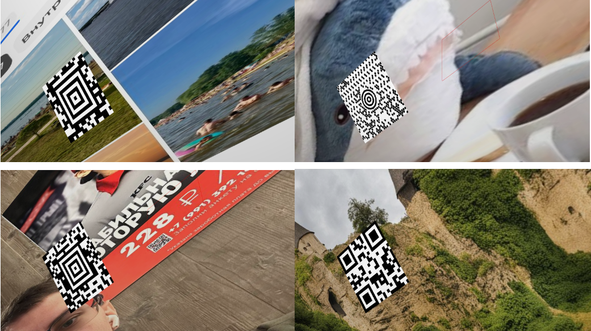
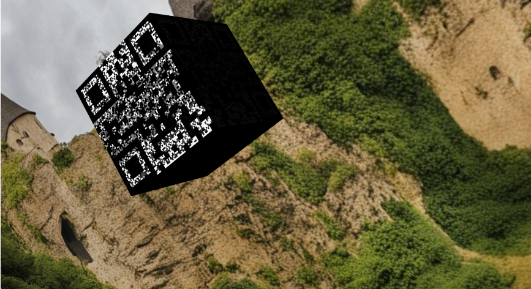
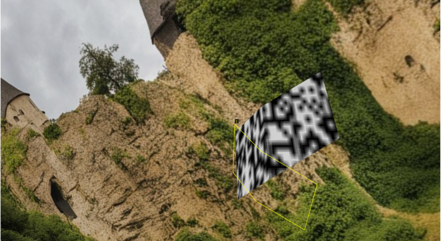
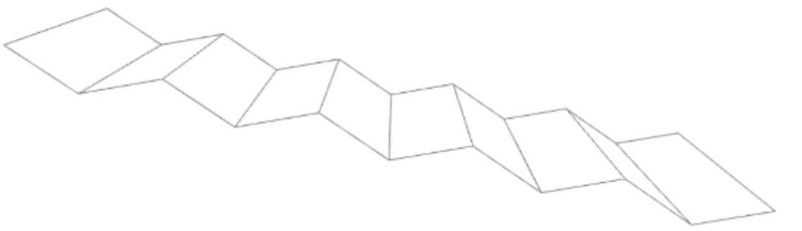
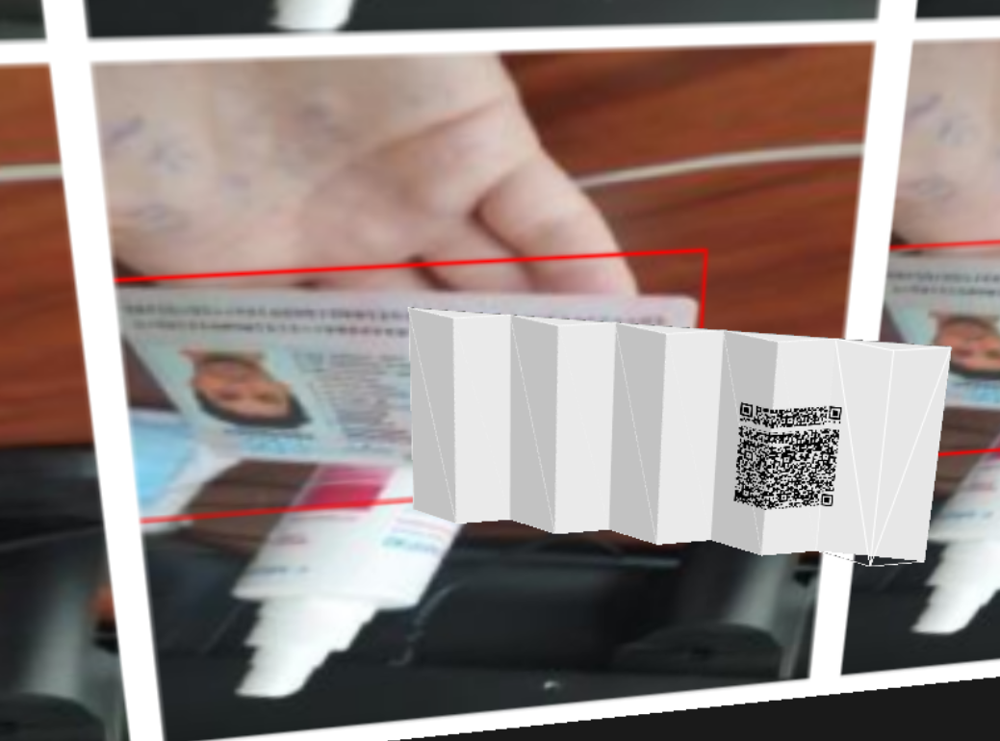
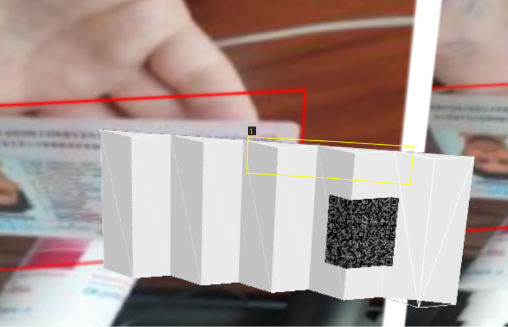

# Three-Dimensional Display of Barcodes

## Problem Statement
Generate a dataset with various noisy barcodes mapped onto a 3D mesh of a bent sheet.

### Initial Requirements
The developed program should support the generation of the following types of barcodes: Quick Response Code (QR), Aztec Code, Aztec Rune, Code One, Grid Matrix, Han Xin Code, MaxiCode, Mini Program Code.

In addition to generating barcodes on flat surfaces, it is necessary to implement the ability to render barcodes on three-dimensional objects.

There should be an option to add a background behind the barcode and apply noise using an algorithm developed by Nikita Gurov.

Barcodes are square-shaped.

### Starting Point
A code was written that renders a document on a flat surface. It visualized a mesh, mapped a texture onto it, configured the camera, and rendered the document. The code is available at [this link](https://github.com/ab8080/rendering).

### Steps to Achieve the Result

- Study VIA VGG version 2, manually annotate barcodes, and agree on the annotations.
- Generate barcodes.
- Study 3D objects on which barcodes can be mapped.
- Modify existing code to map textures onto non-flat objects.
- Integrate with Nikita; use barcodes generated by him.
- Use the 3D mesh provided by Kirill (a model of a bent sheet).
- Calculate the coordinates of the rendered barcode boundaries.
- Generate a large number of barcodes with annotations.

### Tools Used

- C++17
- VTK Library
- Python
- Bash
- VIA VGG v2

### Results

- Agreed on the annotation: the file is available for download at [this link](https://github.com/ab8080/mipt2024s-4-briker-a/blob/main/%D0%A2%D1%80%D0%B5%D0%B1%D0%BE%D0%B2%D0%B0%D0%BD%D0%B8%D1%8F%D0%9A%D0%90%D0%BD%D0%BD%D0%BE%D1%82%D0%B0%D1%86%D0%B8%D1%8F%D0%BC.docx).
- Generated and mapped various barcodes onto a flat surface, added a background image.
  
- Integrated Nikita Gurov's code with noisy barcodes.
- Added the ability to map barcodes onto 3D objects: cube, cylinder, bent sheet of paper.
  
  
- Obtained and used a model of a folded sheet of paper. The barcode was mapped onto it.
  
  

The obj file contained only vertex and edge coordinates. Texture coordinates and faces were added to allow the texture to be mapped onto the mesh.

The calculation of the barcode boundary coordinates was not successful.

Algorithm:

- The barcode is displayed on a white sheet. The boundary coordinates of the barcode are saved.
- The texture is mapped onto the 3D mesh. The vector model is aligned geometrically with the image.
- The barcode boundary coordinates in 3D are calculated using barycentric coordinates*.
- The list of 3D point coordinates is converted to 2D coordinates using the vtkCoordinate class.

Algorithm result:
  

The coordinates of the vertices in the resulting annotation are:
```json
{
  "all_points_x": [497.628, 596.459, 689.633, 685.2, 593.497, 496.174],
  "all_points_y": [254.002, 259.126, 265.23, 309.252, 302.588, 296.992]
}
```
There are 6 of them, which is correct, but the boundary is incorrect.

*Barycentric coordinates are a way of representing a point inside a triangle (or tetrahedron in 3D) as a weighted sum of its vertices. For each vertex of the triangle, it is checked whether it falls within the boundaries of the barcode, and then the 3D coordinates of the barcode corners are interpolated using the calculated barycentric coordinates. Interpolation means calculating a value within a range based on known values at its ends.*

A pipeline for generating images is configured. The dataset is not generated because the annotation is incorrect. But with correct annotation, a large number of different images can be generated by changing the camera position, noise level, sheet model, lighting, barcode position on the sheet, tilt angle of various objects in the scene, and background image.

### Conclusions

- The VTK library was studied.
- A program supporting the generation of various barcodes was developed.
- The ability to render barcodes on three-dimensional objects was developed.
- The main part of the algorithm for obtaining annotation was developed but needs improvement.

The code is available at [this link](https://github.com/ab8080/mipt2024s-4-briker-a).

Report in Russian is available 

